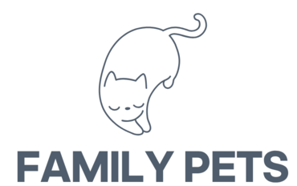
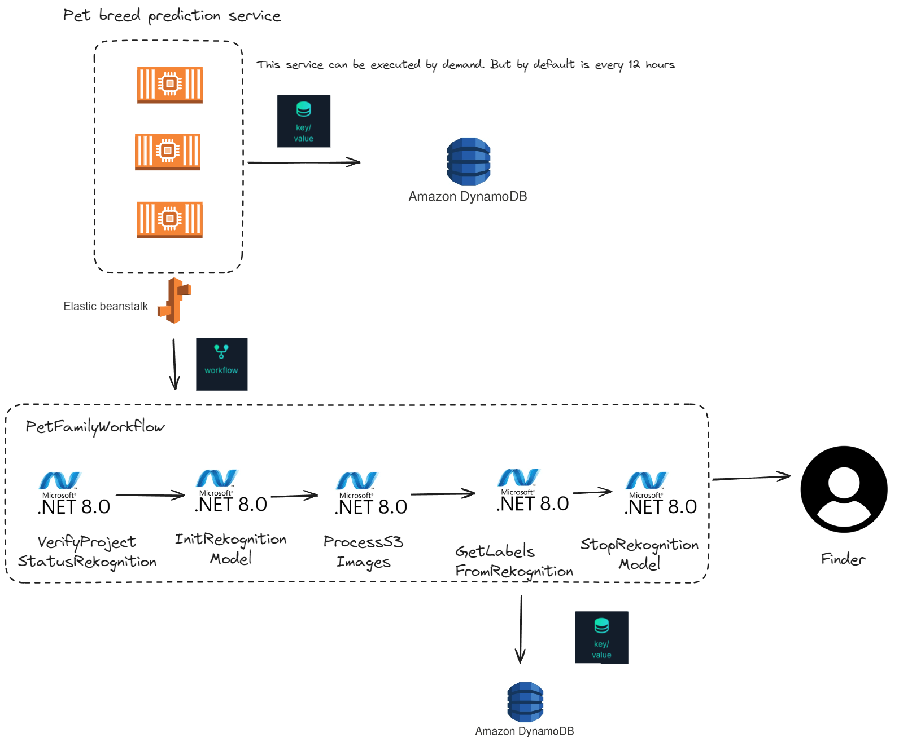

# FamilyPets

## Mission

Our mission is to assist in the search for lost pets with families
through a seamless, transparent and compassionate process using Diagrid Catalyst.

## How it works

1. User Registration: Users can create a new account. 
2. Pet Reporting: After a successful login, users can report found or lost pets. 
3. Image Matching: Every 12 hours, PetWorkflow runs to update image matches between found and lost pets. 
4. Rewards: Users are rewarded for their contributions.

### Workflows

|  | 
|:------------------------------------:| 
|           *User Workflow*            |

|  | 
|:----------------------------------------------:| 
|               *Pet Service App*                |

|  | 
|:------------------------------------------------:| 
|              *Diagrid PetWorkflow*               |

## Project structure

> Folder structure for backend and frontend apps

### A typical top-level directory layout

    .
    ├── backend                  # 3 Projects build .NET
    │   ├── PetWorkflow          # In charge of loading the model and process images
    │   ├── PetCenterCallPet     # Validation images
    │   ├── PetCenterServices    # In charge of save images on S3 bucket
    ├── frontend-client          # UI app with Cognito
    └── README.md

## Installation

1. Clone the repository: `git clone https://github.com/Ksantacr/FamilyPetsHackatonDiagrid.git`
2. Add setting for `frontend-client` app
   3. Follow README.md instructions
3. Add setting for backend projects
   4. PetCenterCallPet: README.md
   5. PetCenterServices: README.md
   6. PetWorkflow: README.md

## Resources

- [Diagrid Docs](https://docs.diagrid.io/)
- [Diagrid Blog](https://www.diagrid.io/blog)
- [Catalyst Pizza Demo](https://github.com/diagrid-labs/catalyst-pizza-demo/)
- [Workflow demos](https://github.com/diagrid-labs/dapr-workflow-demos)
- [AWS Rekognition](https://aws.amazon.com/es/rekognition/)
- [AWS Elastic Beanstack](https://aws.amazon.com/es/elasticbeanstalk/)
- [AWS S3](https://aws.amazon.com/es/s3/)
- [The Oxford-IIIT Pet Dataset](https://www.kaggle.com/datasets/tanlikesmath/the-oxfordiiit-pet-dataset/data)
- [PetBreed Prediction Wit Amazon Rekognition](https://github.com/aws-samples/pet-breed-prediction-with-amazon-rekognition/)
- [.NET 8 Docs](https://dotnet.microsoft.com/en-us/learntocode)
