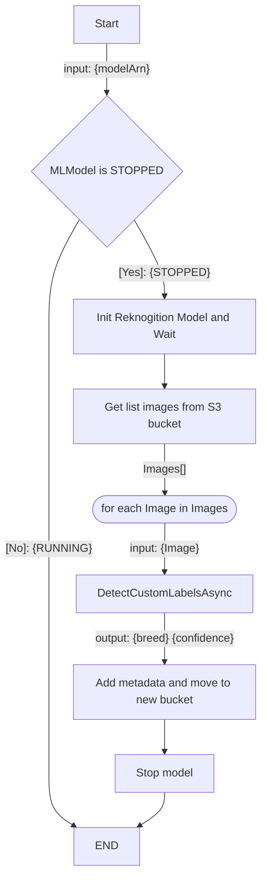

# PetWorkflow

## Configuration

1. Create a new Application id: `basic-workflows`
1.	diagrid appid create workflow-app
1. Build the project: `dotnet build`
1. Configure environment variables:
	1. `export DAPR_HTTP_ENDPOINT=DAPR_HTTP_ENDPOINT`
	1. `export DAPR_GRPC_ENDPOINT=DAPR_GRPC_ENDPOINT`
	1. `export DAPR_API_TOKEN=DAPR_API_TOKEN`

## Workflow

